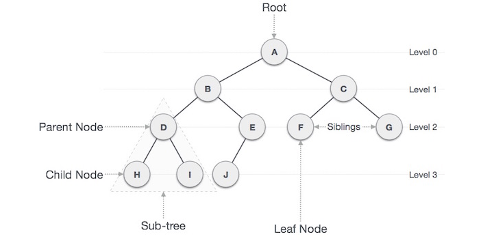

<style>
body {
text-align: justify}
</style>

```{r setup, include=FALSE}
knitr::opts_chunk$set(echo = TRUE)
```

## Pendahuluan 

Bagi sebagian orang pohon keluarga (family tree) merupakan suatu informasi yang penting, karena dari informasi tersebut bisa diketahui posisi seseorang didalam keluarga dan bagaimana dia bersikap kepada anggota keluarga lainnya. Sebagai contoh bagi mayoritas orang batak pohon keluarga sangatlah penting untuk mengetahui seseorang harus menggunakan panggilan apa kepada anggota keluarga lainnya (opung, tulang, dll), dan dari pohon keluarga juga bisa diketahui seberapa dekat hubungan kekerabatan seserang. 

Project ini memvisualisasikan pohon keluarga dalam bentuk tree menggunakan package `collapsibleTree` serta menjadikannya dashboar agar lebih interaktif menggunakan `shiny` web dashboard.

```{r message=F, warning=F}
library(dplyr) # data wrangling
library(stringr) # string manipulation
library(collapsibleTree) # tree visualization
library(data.tree) # tree format dataset
```


## Visualisasi Sederhana

Data yang digunakan merupakan silsilah kerajaan Ingris. 
```{r}
df_fam <- read.csv("data/UKRoyalFamily.csv", na.strings = "")
df_fam
```

Data tersebut memiliki 3 kolom yaitu:     
- `parent`: orang tua dari child      
- `child`: anak dari parent     
- `generation`: urutan generasi. semakin besar nilai generation maka semakin muda  


Bila dilihat pada baris pertama kolom parent bernilai NA, Hal itu sebagai penanda bahwa Elizabeth II merupakan root pada tree nantinya.
Untuk memvisualisasikannya bisa langsung menggunakan fungsi `collapsibleTreeNetwork`. Visualisasi yang dihasilkan berupa graf yang interaktif. 

```{r}
collapsibleTreeNetwork(df_fam)
```


Terlihat mudah bukan? Kalau begitu bagaimana kalau kita buat lebih menantang dengan membuat beberapa feature tambahan seperti:
- Subset tree
- Mencari hubungan dari anggota keluarga


## Basic Graph

Bagi kebanyakan orang pasti sudah familiar dengan struktur dataframe (baris dan kolom), struktur data ini sulit digunakan untuk menjawab 2 pertanyaan diatas, oleh sebab itu kita perlu merubah struktur data menjadi sebuah tree. Pada dasarnya tree merupakan sebuah graph yang berisi kumpulan node yang saling terhubung. Gambar dibawah merupakan penjelasan terkait tree. 

```{r echo=F}

```


### Subset Tree

Ketika tree semakin besar, dan kita hanya tertarik pada sebagian dari tree itu saja berarti kita butuh melakukan subset pada tree yang sudah ada. Sebagai contoh bila kita ingin fokus melihat keturunan dari *Charles* berarti kita hanya akan mengambil sebagian tree dan menjadikan *Charles* sebagai root. Untuk menjawab itu kita perlu mengubah struktur data yang semula dataframe menjadi tree dengan bantuan function `FromDataFrameNetwork` dari package `data.tree`.

```{r}
tree_fam <- df_fam %>% 
  arrange(generation) %>% # mengurutkan data berdasarkan generasi
  slice(-1) %>%  # membuang baris pertama
  mutate_at(vars(parent, child), str_replace_all, " ", "_") %>% # mengganti spasi dengan _ 
  FromDataFrameNetwork() # mengubah dataframe menjadi tree/node

class(tree_fam)
```

Ketika struktur data sudah berupa tree, kita bisa melakukan operasi `findNode` untuk mencari tau siapa saja keturuan dari *Charles*.\
```{r}
name <- "Charles"
FindNode(tree_fam, name)
```

Hubungan antar orang bisa dilihat dari garisnya, *Charles* terhubung langsung dengan *Willian* dan *Harry* yang berarti mereka adalah anaknya, dan *George* serta *Charlotte* terhubung dengan *William* yang berarti meraka anak dari *william*. Agar lebih mudah dipahami bisa kita visualisasikan.

```{r}
FindNode(tree_fam, name) %>% 
  ToDataFrameNetwork() %>% #  mengubah tree menjadi dataframe
  add_row(from = NA, to = name) %>% # menambahkan parent row
  collapsibleTreeNetwork(collapsed = F)
```

perlu diingat bahwa sebelum divisualisasikan data perlu diubah kembali menjadi dataframe dengan function `ToDataFrameNetwork`. parameter `collapsed = F` pada function `collapsibleTreeNetwork` agar tree keluar secara penuh. 

Sekarang bagaimana cara mengetahui kedekatan seseorang dengan anggota keluarga lainnya? sebagai contoh kita akan mencari tahu hubungan antar *Louise* dengan *Anne*. 

```{r}
name1 <- "Louise"
name2 <- "Anne"

path1 <- FindNode(tree_fam, name1)$path
path2 <- FindNode(tree_fam, name2)$path

path1
path2
```

dari informasi path kita bisa mengetahui bahwa "parents" dari *Louise* merupakan *Edward* kemudian *Elizabeth_II*, sedangkan "Parent" dari *Anne* merupakan *Elizabeth II*, dari sini kita bisa mengetahui bahwa kedua orang tersebut memiliki parents yang sama yaitu *Elizabeth II*. Agar lebih mudah dicari kita bisa menggunakan fungsi dibawah mentuk mencari "ancestor" terdekat.

```{r}
ancestor <- last(path1[path1 %in% path2]) 
ancestor
```

karena kita sudah menemukan rootnya kita bisa membuat visualisasinya

```{r}
subset_tree <- FindNode(tree_fam, ancestor) %>% 
  ToDataFrameNetwork() %>% 
  add_row(from = NA, to = name) %>% 
  mutate_at(vars(from, to), str_replace_all, "_", " ")
collapsibleTreeNetwork(subset_tree, collapsed = F)
```

Agar lebih jelas kita bisa berikan warna pada node node yang menjadi amatan. Kondisi pewarnaan sebagai berikut nama yang dicari (`nama1` dan `nama2`) akan diberikan warna biru ("#cd2626") ancestor diberikan warna merah ("#1874cd") dan node yang lainnya tetap berwana putih ("#FFFFFF")

```{r}
subset_tree <- subset_tree %>% 
  mutate(col = case_when(to %in% c(name1,name2) ~  "#cd2626", 
                         to == str_replace_all(ancestor, "_"," ")  ~ "#1874cd",
                         is.na(from) ~ "#1874cd",
                         TRUE ~ "#FFFFFF"
                         )
         )
collapsibleTreeNetwork(subset_tree, collapsed = F, fill = "col")
```

## Visualization

Visualisasi yang dihasilkan oleh collapsibleTree`collapsibleTree` sudah cukup informatif, tapi sebenarnya kita bisa menambahkan informasi lebih pada setiap nodenya ketika node tersebut di hover (pointer menunjuk node) dengan cara menambahkan parameter tooltip. 

```{r}
df_fam <- df_fam %>% 
  mutate(
         tooltip =  paste0(
           child,
           "<br>Generation: ", generation,
           "<br>"
           )
         )
```

```{r}
collapsibleTreeNetwork(df = df_fam,
                       collapsed = F,
                       tooltipHtml = "tooltip")
```


reference
https://github.com/AdeelK93/collapsibleTree
https://cran.r-project.org/web/packages/data.tree/vignettes/data.tree.html